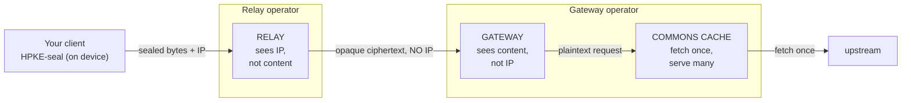

# Architecture: Columbia

An operator-blind HTTP proxy. You fetch public content through it without the person running the servers being able to link who you are to what you fetched. The privacy comes from what each party is structurally unable to see, not from a policy that promises not to look.

## The path

*Identity (relay) and content (gateway) live in separate trust domains.*

| Component | Role | Sees |
|---|---|---|
| Relay | strips client IP and all headers, forwards opaque ciphertext | client IP plus opaque bytes, never content |
| Gateway | decapsulates the request, fetches an allowlisted target, re-encapsulates | request content, never the client IP |
| Commons cache (optional) | fetches each public item once, serves many | public content only, no user identity |

The token issuer sits off this request path. It gates who may use the relay by issuing anonymous tokens the relay verifies, never touching the request itself; see [Anonymous client tokens](#anonymous-client-tokens).

The transport is [OHTTP (RFC 9458)](https://www.rfc-editor.org/rfc/rfc9458). The client HPKE-seals each request against the gateway's public key (`message/ohttp-req`), the relay forwards the sealed bytes on without revealing the client, the gateway decrypts to the inner [Binary HTTP (RFC 9292)](https://www.rfc-editor.org/rfc/rfc9292) (`message/bhttp`) request, fetches the target, and returns the HPKE-sealed response (`message/ohttp-res`). The crypto is HPKE ([RFC 9180](https://www.rfc-editor.org/rfc/rfc9180)). The gateway publishes two key configs: a primary config using KEM `X25519+Kyber768-draft00` (KEM id `0x30`), a draft, non-RFC, post-quantum hybrid of X25519 and Kyber768 (treat it as experimental), and a legacy config using `DHKEM(X25519, HKDF-SHA256)` (KEM id `0x20`), the classical RFC 9180 suite. Both pair the KEM with `HKDF-SHA256` and `AES-128-GCM`. The gateway is Cloudflare's `privacy-gateway-server-go` (vendored, BSD-3). A classical-only RFC 9458 client interoperates by selecting the legacy config (KEM `0x20`); the primary config is a draft post-quantum suite that not every client supports.

### Abuse controls

The relay is the public surface, so it carries the abuse controls. The design constraint is that none of them may weaken the operator-blind property, so all of their state is in memory, keyed to nothing that ties back to content, and never logged. It is dropped on restart.

- A per-IP fixed-window rate limit plus a global in-flight concurrency cap, both env-tunable. The per-IP key is the address the trusted ingress terminates: behind a single managed ingress the TCP peer is the ingress, so the relay reads the rightmost `X-Forwarded-For` entry. When the request crosses more than one proxy (a CDN or Front Door in front of the platform ingress) that rightmost entry is the nearest proxy rather than the client, which would collapse every client into one bucket; set `TRUSTED_CLIENT_IP_HEADER` to the front proxy's trusted client-IP header (`x-azure-clientip`, `cf-connecting-ip`) to key per real client. That IP is the same one the relay already terminates and is allowed to see; using it as a transient counter key reveals nothing the relay did not already hold, and it is never written to a log or forwarded to the gateway. Over-limit requests get a 429. A bounded key table keeps a spoofed-source flood from growing memory.
- A strict request shape: only `POST /relay` with `Content-Type: message/ohttp-req` is served (wrong type returns 415, any other path or method returns 404), so there is no general proxy surface to probe.
- A pluggable client-auth hook with three modes: `off` (network controls only), `secret` (a shared-secret header checked in constant time), and `token` (an anonymous issuer-signed token verified offline). The shared-secret mode is an extractable speed-bump, not real client authentication. The token mode is the real client gate, backed by the token issuer below. The credential is never logged in any mode.

A relay-to-gateway shared secret runs alongside these. The relay attaches a constant `X-Columbia-Relay-Auth` header to its outbound request, and the gateway rejects `/gateway` traffic that lacks a matching value (constant-time, before any HPKE work). Being constant across all requests, it identifies the relay, never a client, so it leaks nothing about who is on the other end.

### Single public surface

The relay is the only publicly reachable component. The gateway and the commons cache run on internal ingress, reachable only from inside the environment, and the token issuer is its own public service alongside the relay. With the gateway internal, clients cannot fetch its `GET /ohttp-configs` to pin the public key config, so the relay proxies that one read-only endpoint: it returns the gateway's key-config bytes verbatim, cached briefly. The key config is public material clients are meant to pin, so this passthrough adds no surface that could leak identity. This posture sits on top of the two-operator non-collusion split, not in place of it: each operator still runs its own component, and the gateway stays off the open internet. [SELFHOSTING.md](./SELFHOSTING.md#single-public-surface-internal-gateway-and-commons) covers the deployment details.

### Edge front door

A CDN or WAF can sit in front of the public relay and issuer to absorb DDoS and rate-limit per IP at the edge before traffic reaches the origins. When the relay and issuer are configured to require it, they reject any request that did not arrive through that front door, verified through a front-door identifier the front door injects into a header. This pins each public origin to the front door so its host cannot be hit directly. The check is inert unless an operator enables it, and the identifier is never logged. Health probes are exempt so the platform can still reach the origins in-environment, and the issuer's `GET /issuer-keys` is exempt because the relay fetches it directly. A managed front door is one way to run this; any CDN or WAF that injects a verifiable origin-lock header works. See [SELFHOSTING.md](./SELFHOSTING.md#edge-front-door-cdn--waf).

## Anonymous client tokens

`token` mode answers a question the network controls cannot: let only a genuine, rate-limited client use the relay, without that gate becoming a way to identify the client. The token issuer is a separate service that plays the Attester and Issuer roles of the Privacy Pass architecture ([RFC 9576](https://www.rfc-editor.org/rfc/rfc9576)).

- The device proves it is genuine Apple hardware running an unmodified install with App Attest. The issuer is the one component allowed to see the device identity at issuance time.
- The device blinds its token inputs locally and sends only the blinded messages. The issuer blind-signs each with the current epoch RSA private key ([RFC 9474](https://www.rfc-editor.org/rfc/rfc9474), `RSABSSA-SHA384-PSS`, the Apple Private Access Token construction from [RFC 9578](https://www.rfc-editor.org/rfc/rfc9578)) and returns blind signatures. It never unblinds, so it never sees a finished token.
- A per-device per-epoch quota bounds issuance, so even a genuine device is rate limited.
- The device finalizes each token locally, then spends one per relay request in the outer OHTTP header. The relay verifies the signature offline against the issuer's published epoch public key and enforces spend-once. It fetches that public key once and caches it, so there is no per-request call to the issuer and the issuer never learns which token was spent.

The blind signature severs the device identity the issuer saw at issuance from the token the relay sees at spend time. The unblinding factor never leaves the device, so even if one operator ran both the issuer and the relay, it could not match a token back to the device that requested it from a single request. Keep them under separate non-colluding operators anyway: with enough traffic shaping, an operator that holds both views could begin to correlate issuance and spend timing across many requests. The keypair rotates per epoch (one week by default), so everyone issued in the same epoch is one anonymity set, and the quota counter and spend-once set both self-expire when the epoch rolls.

The exact wire format, the App Attest binding, and the epoch model are in [`token-issuer/PROTOCOL.md`](./token-issuer/PROTOCOL.md).

## Trust and threat model

The design keeps identity and content with two separate parties, so neither one can reconstruct your reading history.

| Party | Client IP? | Request content? | Notes |
|---|---|---|---|
| Client (you) | n/a | yes | holds the only key that can open the response |
| Relay | yes | no | only ever holds `message/ohttp-req` ciphertext, can't decrypt |
| Gateway | no | yes | the relay sends a fresh request with no client IP or headers; the gateway holds the HPKE seed |
| Commons cache | no | public content only | sits behind the gateway, serves identical public content to everyone |
| Token issuer | sees the device id at issuance | no | only blinded token requests; never the finished token, never the content it is spent on |
| Upstream | sees the gateway's IP | yes | never sees your IP, sees one shared fetcher |

No single party ever holds identity and content at the same time. The relay has identity without content, the gateway has content without identity, and the issuer sees a device identity but only blinded material it cannot tie to any spent token.

### Non-collusion

This only holds if the relay and the gateway are run by different operators who don't collude. If one operator controls both, they can line up the IP they saw at the relay against the content they decrypted at the gateway, and the property is gone. Two ways to run it:

- Single operator, for testing or convenience. Running both yourself proves the data path works end to end, but it gives you no protection against yourself. Use it to develop, or when you trust the single operator completely (it's you, and all you care about is hiding from upstream).
- Two operators, for the real guarantee. Run the relay at one operator and the gateway at another. Ideally different organizations or providers, ideally not both you. Now identity and content sit in genuinely separate trust domains, and breaking the property takes both of them misbehaving together. [SELFHOSTING.md](./SELFHOSTING.md) covers how to split them.

### Residual risks

Worth being straight about what this doesn't solve:

- Per-user key targeting. A malicious gateway could hand one client a unique HPKE key to single them out. Pinning the key config fingerprint catches a change; checking that everyone sees the same key (RFC 9540 key consistency, or a transparency log) catches divergence. See [ROADMAP.md](./ROADMAP.md).
- Gateway memory. Without confidential compute, the gateway operator could in principle read decrypted content or the HPKE key out of process memory. Attestation and key release (below) close that.
- Traffic analysis. Correlating timing and size across the two hops is out of scope here. OHTTP stops the operators from linking you; it does nothing about a global passive adversary watching both networks at once.
- Authenticated and write traffic is out of scope by design, not a gap. Columbia carries public, sessionless reads only; your client makes any request tied to your identity (including writes) directly over its own session, so it never passes through a shared gateway. Routing authenticated traffic through the gateway would put an identity-bound request in front of the operator and defeat the whole model, so keeping it on your own session is the deliberate choice.

## Attestation chain (optional, advanced)

To get rid of the "gateway operator could read memory" risk, and to turn key pinning into real verification, run the gateway in a confidential VM and have the client check a hardware attestation before it trusts the channel:

1. Confidential VM. Run the gateway in an AMD SEV-SNP confidential VM (or equivalent) so the host and operator can't read gateway memory.
2. Attestation. The platform produces a signed attestation, either a DCAP quote or a Microsoft Azure Attestation (MAA) JWT, carrying the VM's launch measurement (the hash of the code and config that booted).
3. Client verification. Before sealing, the client fetches the attestation, validates the signature chain back to the hardware root, and compares the launch measurement against a pinned known-good value. Three checks make this verification sound:
   - Freshness. The client supplies a fresh nonce in the attestation request and rejects any quote that doesn't carry it, so a stale or replayed quote can't be passed off as live.
   - Key binding. The attestation must cryptographically bind the specific HPKE key config the client will seal against (for example, the key-config hash carried in the attestation report-data). Without this binding, a valid attestation and a separately pinned key do NOT compose into a trusted channel: an operator can present a good VM's attestation while serving a different, extractable key. The client must confirm that the key it pins is the key the attestation vouches for.
   - TCB and revocation. The client checks the SEV-SNP TCB level and collateral against a revocation source, so it refuses a platform whose firmware or microcode has been revoked.
   The channel is trusted only when all of these hold.
4. Secure key release, the strongest version. Keep the HPKE seed in an HSM with a release policy that only hands it to the gateway when the gateway presents a valid attestation matching the expected measurement. Then the operator never holds the key at all.

A client can boil this down to a simple state: trusted only when the gateway is attested (running published, audited code) and key-pinned; degraded when it's pinned but not attested; failed otherwise. The goal is to verify rather than trust, by attesting a measurement that maps to public, reproducible source, with those measurements published to an append-only transparency log.

## Observability

The rule is RED metrics only (rate, errors, duration). Never an IP, a user id, a target, a request body, or a header. Cardinality is bounded by design.

- The relay and cache write structured JSON to stdout: `{ts, route, status, durationMs[, cache]}`. `route` is a template (`/relay`, `/v1/commons`), never a path with values in it. The relay logs `{"route":"/relay","status":200,"durationMs":212}`, which proves a request happened, not who made it or what it fetched.
- The gateway logs operational events only, and `LOG_SECRETS=false` keeps the HPKE seed out of stdout.
- This is enough to run the system on. You get throughput, error rate, latency, cache hit-rate, and per-component health, everything you need to operate and alert, while there is structurally no way to log a reading history. The privacy comes from what is never written, not from trusting a redactor to scrub it after the fact.

## Scalability

- The per-request path is stateless. The relay and gateway hold no per-user state, and HPKE is per-request, so they scale out horizontally with no coordination.
- The cache is what multiplies throughput. Public reads are identical for everyone, so the commons cache turns N clients times M reads into M upstream fetches (TTL, stale-while-revalidate, single-flight). Upstream-facing volume stays flat as usage grows.
- It's CDN-frontable. The cache emits `Cache-Control` and `Age` headers, so a CDN out front edge-caches public content and the cache tier only sees origin-shield traffic. Identical public content means there's no per-user signal to leak.
- Confidential gateways (SEV-SNP CVM plus attestation) are the one tier that usually can't scale to zero. Size that capacity on purpose.
