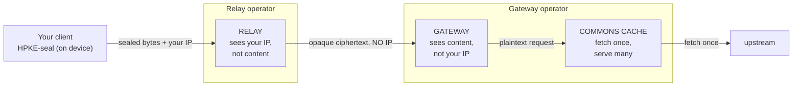
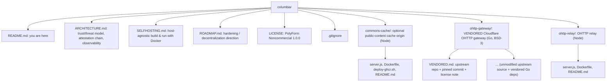

# Columbia

> A self-hostable HTTP proxy toolkit for personal use, built so that whoever runs the servers can't tell who fetched what. The privacy comes from what the system is unable to see, not from a promise that nobody will look.

Columbia is named after Apollo 11's Command and Service Module, the ship that stayed up in orbit while the lander went down, with no view of what happened on the surface.

It's a small toolkit with almost no dependencies. You point it at HTTP content and fetch through a split-trust path built on OHTTP ([RFC 9458](https://www.rfc-editor.org/rfc/rfc9458)). There are three pieces, each a separate service you run yourself, on plain Docker, on whatever host you want.

The property that matters is this: no single operator ever holds your identity and your content at the same time. The relay sees your IP but only opaque ciphertext. The gateway decrypts and fetches but never sees your IP. Run those two as separate operators and neither one can connect you to what you read.

This is a toolkit, not a hosted service. You bring your own servers and your own keys. It's released for personal, non-commercial use (see [LICENSE](#license)).

---

## How it works

*The OHTTP path. No single hop holds both your identity and your content.*



1. The client seals each request locally with HPKE. Only the gateway's public key can open it, and the sealed bytes mean nothing to anyone in between.
2. The relay receives the sealed request. All it ever has is your IP and a blob of ciphertext, never the content and never the target. It forwards that ciphertext to the gateway in a fresh request with no client headers and no `X-Forwarded-For`, so the gateway has no way to learn who you are.
3. The gateway decrypts the request, fetches the target, and encrypts the response on the way back. It sees the request content but not your IP, and it can only reach an allowlist of target origins (`ALLOWED_TARGET_ORIGINS`). Set that allowlist tightly. The gateway does NOT fail closed on its own: if `ALLOWED_TARGET_ORIGINS` is empty or unset, it becomes an open, anonymous proxy and an SSRF pivot that anyone can point at any origin. Matching is by exact `Host` string, so scheme, port, and subdomain are all literal (`example.com` does not cover `api.example.com`).
4. The commons cache is optional. It fetches each public, sessionless item once and serves it to everyone. Because it sits behind the gateway, the operator can't profile reads even for cached content.

So the relay has identity without content, and the gateway has content without identity. As long as different operators run them and the two don't collude, nobody can rebuild your reading history. Running both yourself is fine for testing, but it collapses that non-collusion property (see [SELFHOSTING.md](./SELFHOSTING.md)).

The full trust and threat model, the attestation chain, and the observability design are in [ARCHITECTURE.md](./ARCHITECTURE.md).

---

## What it's for

- Fetching your own HTTP reads through a split-trust path, so neither hop can tie your network identity to what you asked for.
- Caching public content without being able to see who read it. Put the commons cache in front of public, sessionless endpoints (listings, feeds, public APIs) and many reads collapse into a handful of upstream fetches.
- A starting point for building operator-blind transports into your own apps. The pieces are small, they stick to published standards (RFC 9458, 9292, 9180), and they're short enough to read end to end.

Columbia is a read-path privacy layer, nothing more. It carries public, sessionless reads only. Authenticated and write requests are out of scope by design, not by limitation: your client makes those directly over its own session, so they never touch shared infrastructure at all, which is the more private place for them to run anyway. It is not a VPN, and it never pools or shares credentials.

---

## Components

| Directory | Role | What it can see |
|---|---|---|
| [`ohttp-relay/`](./ohttp-relay) | Strips your IP and all headers, forwards opaque ciphertext to the gateway | your IP plus opaque bytes, never content |
| [`ohttp-gateway/`](./ohttp-gateway) | Decapsulates the request, fetches the allowlisted target, re-encapsulates the response | request content, never your IP |
| [`commons-cache/`](./commons-cache) | Fetches each public item once and serves all; TTL plus stale-while-revalidate plus single-flight | public content only, no user identity |

- `ohttp-relay/` is a Node service with no dependencies. It forwards `message/ohttp-req` bodies to the gateway in a fresh request that carries no client headers and no `X-Forwarded-For`. As the one public surface it also carries the abuse controls (per-IP rate limiting, a concurrency cap, a strict request shape, and a pluggable client-auth hook), all keeping ephemeral state that is never logged. For the hardened topology it can run as the sole public hop, with the gateway and cache on internal ingress, and pass the gateway's public key config through to clients. See [SELFHOSTING.md](./SELFHOSTING.md). Its logs are RED metrics only.
- `ohttp-gateway/` is a vendored copy of Cloudflare's [`privacy-gateway-server-go`](https://github.com/cloudflare/privacy-gateway-server-go) (BSD-3, the RFC 9458 reference gateway). The source is unmodified; everything it does is configured at runtime through environment variables. Provenance and the required attribution live in [`ohttp-gateway/VENDORED.md`](./ohttp-gateway/VENDORED.md).
- `commons-cache/` is another dependency-free Node service, an optional cache origin for public, sessionless content. It serves `X-Cache: HIT|MISS|STALE` with CDN-ready `Cache-Control` and `Age` headers.

---

## Quickstart

You'll need [Docker](https://docs.docker.com/get-docker/) and OpenSSL. The fastest way to see the whole path on one machine:

```sh
# 1. Generate the gateway's HPKE seed (32-byte hex). Keep this secret.
export SEED_SECRET_KEY="$(openssl rand -hex 32)"

# 2. Build and run the gateway. ALLOWED_TARGET_ORIGINS restricts what it may fetch.
cd ohttp-gateway
docker build -t columbia-gateway .
docker run -d --name gateway -p 8080:8080 \
  -e PORT=8080 \
  -e SEED_SECRET_KEY="$SEED_SECRET_KEY" \
  -e LOG_SECRETS=false \
  -e ALLOWED_TARGET_ORIGINS="http://commons:8080" \
  columbia-gateway

# 3. Build and run the relay, pointed at the gateway.
cd ../ohttp-relay
docker build -t columbia-relay .
docker run -d --name relay -p 8081:8080 \
  -e PORT=8080 \
  -e GATEWAY_URL="http://gateway:8080/gateway" \
  columbia-relay

# 4. (Optional) Build and run the commons cache as the gateway's upstream target.
cd ../commons-cache
docker build -t columbia-commons .
docker run -d --name commons -p 8082:8080 -e PORT=8080 columbia-commons
```

> For the real walkthrough (a shared Docker network, generating and pinning the gateway key config, configuring the cache, and running the relay and gateway as separate operators so non-collusion actually holds) read [SELFHOSTING.md](./SELFHOSTING.md).

An OHTTP client (any RFC 9458 library, for example one built on Apple CryptoKit or [`ohttp`](https://github.com/cloudflare/privacy-gateway-server-go)) seals a request against the gateway's published key config and POSTs the `message/ohttp-req` body to the relay. The relay hands back the encapsulated `message/ohttp-res`, which the client opens locally. The gateway publishes two key configs: a primary draft post-quantum suite (KEM `0x30`, `X25519+Kyber768-draft00`) and a legacy classical suite (KEM `0x20`, `DHKEM(X25519, HKDF-SHA256)`). A classical-only RFC 9458 client must select the legacy config; the primary config is a draft, non-RFC suite that not every client supports.

---

## Logging

The whole thing falls apart if the logs record what the crypto hides, so the rule is RED metrics only (rate, errors, duration) and nothing else.

- Each service writes structured JSON to stdout: `{ts, route, status, durationMs[, cache]}`. The `route` is always a template (`/relay`, `/v1/commons`), never a path that contains a target, a query value, or a body. Cardinality stays bounded because there's nothing high-cardinality to write.
- The gateway logs operational events only, and with `LOG_SECRETS=false` the HPKE seed never reaches stdout.
- You still get everything you need to run the thing: throughput, error rate, latency, cache hit-rate, per-component health. What you can't get, because it's never written down, is a user's reading history.

---

## Transparency

The idea is that you verify the privacy property rather than take it on faith.

- It holds by construction, not by policy. The relay can't log content because it only ever holds ciphertext. The gateway can't log your IP because it never receives it.
- Pin the gateway key. A client can pin the SHA-256 of the gateway's published HPKE key config and refuse to seal to anything else, which makes a swapped key obvious. Pinning only catches a key that CHANGES after first use; it does not catch a gateway that targets you with a unique key from the very first request (trust-on-first-use). Closing that gap means cross-checking that everyone sees the same key (RFC 9540 key consistency or a transparency log), which is not yet built.
- Attestation is optional and more involved. Run the gateway in a confidential VM (AMD SEV-SNP) and have clients check a hardware attestation (DCAP or Microsoft Azure Attestation) before they seal. Then the channel is trusted only when the gateway is provably running the published, audited code, and the operator can't pull decrypted content or the HPKE key out of memory. Details are in [ARCHITECTURE.md](./ARCHITECTURE.md) and [ROADMAP.md](./ROADMAP.md).

---

## Repository layout



## Standards

| RFC | Used for |
|---|---|
| [RFC 9458](https://www.rfc-editor.org/rfc/rfc9458) | OHTTP, the relay/gateway split-trust transport |
| [RFC 9292](https://www.rfc-editor.org/rfc/rfc9292) | Binary HTTP, the inner `message/bhttp` request/response |
| [RFC 9180](https://www.rfc-editor.org/rfc/rfc9180) | HPKE. The gateway publishes two key configs (see note below). |

The gateway publishes two HPKE key configs:

- A primary config using KEM `X25519+Kyber768-draft00` (KEM id `0x30`), a draft, non-RFC, post-quantum hybrid of X25519 and Kyber768. Treat it as experimental: it is a draft suite, not an RFC-registered one.
- A legacy config using `DHKEM(X25519, HKDF-SHA256)` (KEM id `0x20`), the classical RFC 9180 suite (`DHKEM(X25519, HKDF-SHA256)` / `HKDF-SHA256` / `AES-128-GCM`).

A classical-only client picks the legacy config; a client that wants the post-quantum hybrid picks the primary config. Both use `HKDF-SHA256` and `AES-128-GCM`.

## License

Columbia is under the PolyForm Noncommercial License 1.0.0. Personal and non-commercial use is allowed; commercial use is not. The full text is in [`LICENSE`](./LICENSE).

The vendored `ohttp-gateway/` is Cloudflare's `privacy-gateway-server-go` under BSD 3-Clause, and its `LICENSE` is kept unmodified (see [`ohttp-gateway/VENDORED.md`](./ohttp-gateway/VENDORED.md)). The PolyForm license covers the parts written here: `commons-cache/`, `ohttp-relay/`, and the top-level docs.
