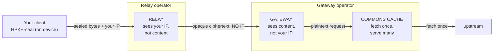

# Columbia

> A self-hostable HTTP proxy toolkit for personal use, built so that no operator can link who made a request to what was fetched. Privacy derives from what each party is structurally unable to observe, not from a policy commitment.

Columbia is named after Apollo 11's Command and Service Module, which stayed in orbit without visibility into the lunar surface operations below.

The toolkit has almost no dependencies. HTTP content is fetched through a split-trust path built on OHTTP ([RFC 9458](https://www.rfc-editor.org/rfc/rfc9458)). Three services carry the request path (relay, gateway, commons cache), and a fourth optional service (the token issuer) gates who may use the relay without identifying them. Each runs as a self-hosted service on Docker, on any host.

No single operator ever holds both client identity and request content at the same time. The relay sees the client IP but only opaque ciphertext. The gateway decrypts and fetches but never sees the client IP. Run the two as separate operators and neither can link a client to the content it fetched.

This is a toolkit, not a hosted service; it requires self-provided servers and keys. It is released for personal, non-commercial use (see [LICENSE](#license)).

---

## How it works

*The OHTTP path. No single hop holds both client identity and request content.*



1. The client seals each request locally with HPKE. Only the gateway's public key can open it, and the sealed bytes mean nothing to anyone in between.
2. The relay receives the sealed request. All it ever holds is the client IP and ciphertext, never the content and never the target. It forwards that ciphertext to the gateway in a fresh request with no client headers and no `X-Forwarded-For`, so the gateway cannot learn the client's identity.
3. The gateway decrypts the request, fetches the target, and encrypts the response on the way back. It sees the request content but not the client IP, and it can only reach an allowlist of target origins (`ALLOWED_TARGET_ORIGINS`). Set that allowlist tightly. The gateway does NOT fail closed on its own: if `ALLOWED_TARGET_ORIGINS` is empty or unset, it becomes an open, anonymous proxy and an SSRF pivot that anyone can point at any origin. Matching is by exact `Host` string, so scheme, port, and subdomain are all literal (`example.com` does not cover `api.example.com`).
4. The commons cache is optional. It fetches each public, sessionless item once and serves it to everyone. Because it sits behind the gateway, the operator can't profile reads even for cached content.

The relay thus holds identity without content, and the gateway holds content without identity. As long as different operators run them and the two do not collude, no party can reconstruct a client's reading history. Running both under a single operator is acceptable for testing, but it collapses the non-collusion property (see [SELFHOSTING.md](./SELFHOSTING.md)).

The full trust and threat model, the attestation chain, and the observability design are in [ARCHITECTURE.md](./ARCHITECTURE.md).

---

## What it's for

- Fetching HTTP reads through a split-trust path, so neither hop can tie a client's network identity to the content requested.
- Caching public content without exposing who read it. Placing the commons cache in front of public, sessionless endpoints (listings, feeds, public APIs) collapses many reads into a small number of upstream fetches.
- A starting point for building operator-blind transports into applications. The components are small and adhere to published standards (RFC 9458, 9292, 9180 for the transport; RFC 9576, 9474, 9578 for the anonymous tokens).

Columbia is a read-path privacy layer. It carries public, sessionless reads only. Authenticated and write requests are out of scope by design: the client makes those directly over its own session, so they never touch shared infrastructure. It is not a VPN, and it does not pool or share credentials.

---

## Components

| Directory | Role | What it can see |
|---|---|---|
| [`ohttp-relay/`](./ohttp-relay) | Strips your IP and all headers, forwards opaque ciphertext to the gateway | your IP plus opaque bytes, never content |
| [`ohttp-gateway/`](./ohttp-gateway) | Decapsulates the request, fetches the allowlisted target, re-encapsulates the response | request content, never your IP |
| [`commons-cache/`](./commons-cache) | Fetches each public item once and serves all; TTL plus stale-while-revalidate plus single-flight | public content only, no user identity |
| [`token-issuer/`](./token-issuer) | App Attest gated, blind-signs anonymous unlinkable tokens the relay verifies offline | the device id at issuance, never the spent token or the content fetched |

- `ohttp-relay/` is a Node service with no dependencies. It forwards `message/ohttp-req` bodies to the gateway in a fresh request that carries no client headers and no `X-Forwarded-For`. As the public surface it carries the abuse controls described below. Its logs are RED metrics only.
- `ohttp-gateway/` is a vendored copy of Cloudflare's [`privacy-gateway-server-go`](https://github.com/cloudflare/privacy-gateway-server-go) (BSD-3, the RFC 9458 reference gateway). The source is unmodified apart from two small env-gated access controls; everything else it does is configured at runtime through environment variables. Provenance and the required attribution live in [`ohttp-gateway/VENDORED.md`](./ohttp-gateway/VENDORED.md).
- `commons-cache/` is another dependency-free Node service, an optional cache origin for public, sessionless content. It serves `X-Cache: HIT|MISS|STALE` with CDN-ready `Cache-Control` and `Age` headers.
- `token-issuer/` is its own service. It runs Apple App Attest verification and blind-signs ([RFC 9474](https://www.rfc-editor.org/rfc/rfc9474)) anonymous tokens so the relay can require a genuine, rate-limited client without a login. It is the one component that learns a device identity; blinding prevents that identity from being linked to any finished token or to the content it is spent on. Verifying a spent token at the relay is offline against the issuer's published epoch public key. See [`token-issuer/PROTOCOL.md`](./token-issuer/PROTOCOL.md) for the wire format and [`token-issuer/README.md`](./token-issuer).

---

## Public surface and abuse controls

The relay is the only service that has to be public. The gateway and the commons cache run on internal ingress, reachable only from inside the environment, and the issuer is its own public service alongside the relay. Because the gateway is internal, clients cannot fetch its key config directly, so the relay proxies that one read at `GET /ohttp-configs` and returns the gateway's public key-config bytes verbatim. That is public material clients are meant to pin, so the passthrough leaks nothing.

The relay carries the abuse controls, none of which weaken the operator-blind property because all of their state is in memory, keyed to nothing that ties back to content, and never logged:

- Per-IP rate limiting keyed on the address the trusted ingress appended, plus a global concurrency cap.
- A strict request shape: only `POST /relay` with `Content-Type: message/ohttp-req` is served.
- A relay-to-gateway shared secret (`X-Columbia-Relay-Auth`) so the gateway rejects traffic that did not come through the relay.
- A pluggable client-auth hook with modes `off`, `secret`, and `token`. In `token` mode the relay verifies an anonymous issuer-signed token offline and enforces spend-once.

A CDN or WAF (for example a managed front door) can sit in front of the public relay and issuer to absorb DDoS and rate-limit at the edge. When the relay and issuer are configured to require it, they reject any request that did not arrive through that front door, so the origins cannot be reached directly. See [SELFHOSTING.md](./SELFHOSTING.md).

---

## Quickstart

Prerequisites: [Docker](https://docs.docker.com/get-docker/) and OpenSSL. To run the full path on one machine:

```sh
# 1. Generate the gateway's HPKE seed (32-byte hex). Keep this secret.
export SEED_SECRET_KEY="$(openssl rand -hex 32)"

# 2. Build and run the gateway. ALLOWED_TARGET_ORIGINS restricts what it may fetch.
cd ohttp-gateway
docker build -t columbia-gateway .
docker run -d --name gateway -p 8080:8080 \
  -e PORT=8080 \
  -e SEED_SECRET_KEY="$SEED_SECRET_KEY" \
  -e LOG_SECRETS=false \
  -e ALLOWED_TARGET_ORIGINS="http://commons:8080" \
  columbia-gateway

# 3. Build and run the relay, pointed at the gateway.
cd ../ohttp-relay
docker build -t columbia-relay .
docker run -d --name relay -p 8081:8080 \
  -e PORT=8080 \
  -e GATEWAY_URL="http://gateway:8080/gateway" \
  columbia-relay

# 4. (Optional) Build and run the commons cache as the gateway's upstream target.
cd ../commons-cache
docker build -t columbia-commons .
docker run -d --name commons -p 8082:8080 -e PORT=8080 columbia-commons
```

> For the full walkthrough (a shared Docker network, generating and pinning the gateway key config, configuring the cache, and running the relay and gateway as separate operators so non-collusion holds), see [SELFHOSTING.md](./SELFHOSTING.md).

An OHTTP client (any RFC 9458 library, for example one built on Apple CryptoKit or [`ohttp`](https://github.com/cloudflare/privacy-gateway-server-go)) seals a request against the gateway's published key config and POSTs the `message/ohttp-req` body to the relay. The relay hands back the encapsulated `message/ohttp-res`, which the client opens locally. The gateway publishes two key configs: a primary draft post-quantum suite (KEM `0x30`, `X25519+Kyber768-draft00`) and a legacy classical suite (KEM `0x20`, `DHKEM(X25519, HKDF-SHA256)`). A classical-only RFC 9458 client must select the legacy config; the primary config is a draft, non-RFC suite that not every client supports.

---

## Logging

The privacy property depends on logs not recording what the crypto hides, so the rule is RED metrics only (rate, errors, duration).

- Each service writes structured JSON to stdout: `{ts, route, status, durationMs[, cache]}`. The `route` is always a template (`/relay`, `/v1/commons`), never a path that contains a target, a query value, or a body. Cardinality stays bounded because there's nothing high-cardinality to write.
- The gateway logs operational events only, and with `LOG_SECRETS=false` the HPKE seed never reaches stdout.
- Operators get what they need to run the system: throughput, error rate, latency, cache hit-rate, per-component health. A user's reading history is not available because it is never written.

---

## Transparency

The privacy property is designed to be verified rather than taken on trust.

- It holds by construction, not by policy. The relay cannot log content because it only ever holds ciphertext. The gateway cannot log the client IP because it never receives it.
- Pin the gateway key. A client can pin the SHA-256 of the gateway's published HPKE key config and refuse to seal to anything else, which makes a swapped key evident. Pinning only catches a key that CHANGES after first use; it does not catch a gateway that targets a client with a unique key from the first request (trust-on-first-use). Closing that gap requires cross-checking that all clients see the same key (RFC 9540 key consistency or a transparency log), which is not yet built.
- Attestation is optional and more involved. Run the gateway in a confidential VM (AMD SEV-SNP) and have clients check a hardware attestation (DCAP or Microsoft Azure Attestation) before they seal. The channel is then trusted only when the gateway is provably running the published, audited code, and the operator cannot extract decrypted content or the HPKE key from memory. Details are in [ARCHITECTURE.md](./ARCHITECTURE.md) and [ROADMAP.md](./ROADMAP.md).

---

## Repository layout

```mermaid
flowchart TD
    root["columbia/"]
    readme["README.md: you are here"]
    arch["ARCHITECTURE.md: trust/threat model, attestation chain, observability"]
    self["SELFHOSTING.md: host-agnostic build &amp; run with Docker"]
    roadmap["ROADMAP.md: hardening / decentralization direction"]
    license["LICENSE: PolyForm Noncommercial 1.0.0"]
    gitignore[".gitignore"]
    security["SECURITY.md: reporting + the guarantee in scope"]
    commons["commons-cache/: optional public-content cache origin (Node)"]
    commonsfiles["server.js, Dockerfile, deploy-ghcr.sh, README.md"]
    gateway["ohttp-gateway/: VENDORED Cloudflare OHTTP gateway (Go, BSD-3)"]
    vendored["VENDORED.md: upstream repo + pinned commit + license note"]
    gatewaysrc["… (unmodified upstream source + vendored Go deps)"]
    relay["ohttp-relay/: OHTTP relay (Node)"]
    relayfiles["server.js, Dockerfile, README.md"]
    issuer["token-issuer/: App Attest + blind-RSA token issuer (Node)"]
    issuerfiles["server.js, appattest.js, PROTOCOL.md, Dockerfile, README.md"]

    root --> readme
    root --> arch
    root --> self
    root --> roadmap
    root --> license
    root --> security
    root --> gitignore
    root --> commons
    commons --> commonsfiles
    root --> gateway
    gateway --> vendored
    gateway --> gatewaysrc
    root --> relay
    relay --> relayfiles
    root --> issuer
    issuer --> issuerfiles
```



## Standards

| RFC | Used for |
|---|---|
| [RFC 9458](https://www.rfc-editor.org/rfc/rfc9458) | OHTTP, the relay/gateway split-trust transport |
| [RFC 9292](https://www.rfc-editor.org/rfc/rfc9292) | Binary HTTP, the inner `message/bhttp` request/response |
| [RFC 9180](https://www.rfc-editor.org/rfc/rfc9180) | HPKE. The gateway publishes two key configs (see note below). |
| [RFC 9576](https://www.rfc-editor.org/rfc/rfc9576) | Privacy Pass architecture, the issuer's Attester and Issuer roles |
| [RFC 9474](https://www.rfc-editor.org/rfc/rfc9474) | Blind RSA (`RSABSSA-SHA384-PSS`), the token blind-signature suite |
| [RFC 9578](https://www.rfc-editor.org/rfc/rfc9578) | Privacy Pass Token Type 2, the Apple Private Access Token construction the issuer mints |

The gateway publishes two HPKE key configs:

- A primary config using KEM `X25519+Kyber768-draft00` (KEM id `0x30`), a draft, non-RFC, post-quantum hybrid of X25519 and Kyber768. Treat it as experimental: it is a draft suite, not an RFC-registered one.
- A legacy config using `DHKEM(X25519, HKDF-SHA256)` (KEM id `0x20`), the classical RFC 9180 suite (`DHKEM(X25519, HKDF-SHA256)` / `HKDF-SHA256` / `AES-128-GCM`).

A classical-only client picks the legacy config; a client that wants the post-quantum hybrid picks the primary config. Both use `HKDF-SHA256` and `AES-128-GCM`.

## License

Columbia is under the PolyForm Noncommercial License 1.0.0. Personal and non-commercial use is allowed; commercial use is not. The full text is in [`LICENSE`](./LICENSE).

The vendored `ohttp-gateway/` is Cloudflare's `privacy-gateway-server-go` under BSD 3-Clause, and its `LICENSE` is kept unmodified (see [`ohttp-gateway/VENDORED.md`](./ohttp-gateway/VENDORED.md)). The PolyForm license covers the parts written here: `commons-cache/`, `ohttp-relay/`, and the top-level docs.
