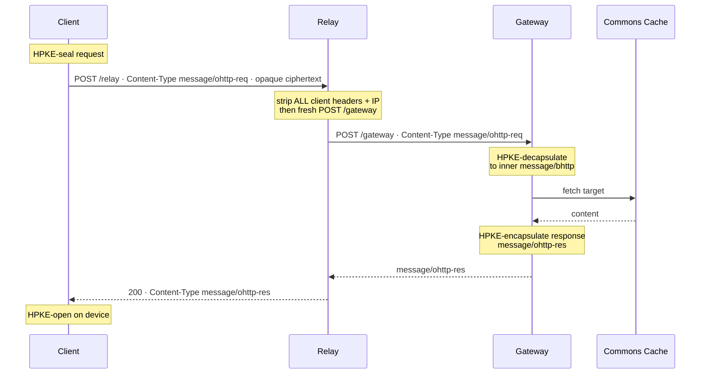

# ohttp-relay

The relay half of the OHTTP ([RFC 9458](https://www.rfc-editor.org/rfc/rfc9458)) split-trust pair. It's the only component that ever sees a client's IP address, and it can do nothing with it, because everything it forwards is an opaque HPKE ciphertext it can't decrypt.

Dependency-free Node (built-in `http` and `https` only).

## Why it exists

OHTTP deliberately keeps who and what with two different parties:

| Party | Sees the client IP? | Sees the request content? |
|---|---|---|
| Relay (this service) | yes | no, only `message/ohttp-req` ciphertext |
| Gateway | no, the relay sends a fresh request | yes, it holds the HPKE key |

Neither party ever holds identity and content together. That's the operator-blind guarantee. The relay's job is to be the network endpoint the client connects to, and to forward the sealed bytes to the gateway without leaking who the client is.

> Non-collusion caveat: for the guarantee to hold, the relay and gateway have to be run by different, non-colluding parties. Running both on one host proves the flow works but provides no protection against the single operator. See [`../SELFHOSTING.md`](../SELFHOSTING.md).

## The OHTTP request/response flow

*The relay forwards opaque ciphertext to the gateway without leaking who the client is.*



### Content types

| Type | Where | What it is |
|---|---|---|
| `message/ohttp-req` | client -> relay -> gateway | the outer HPKE-encapsulated request envelope (RFC 9458). Opaque to the relay. |
| `message/ohttp-res` | gateway -> relay -> client | the outer HPKE-encapsulated response envelope. Opaque to the relay. |
| `message/bhttp` | inside the envelope, only after the gateway decrypts | the inner Binary HTTP ([RFC 9292](https://www.rfc-editor.org/rfc/rfc9292)) request/response, the actual GET to the target. The relay never sees this; only the gateway decrypts down to it. |

## Endpoints

| Route | Method | Purpose |
|---|---|---|
| `/health` | `GET` | liveness, returns `ok` |
| `/relay` | `POST` | accepts a `message/ohttp-req` body, forwards it to the gateway's `/gateway`, returns the `message/ohttp-res` body verbatim |
| `/ohttp-configs` | `GET` | proxies the gateway's public key config so clients can pin the key while the gateway stays internal |

## What it deliberately does not forward

When it relays to the gateway, the service builds a fresh request and sends only:

- the opaque ciphertext body, and
- `Content-Type: message/ohttp-req` plus `Content-Length`.

It leaves out every client header and never adds `X-Forwarded-For`, so the gateway can't learn the client's IP. (See `server.js`. That omission is the security property, not an oversight.)

## Observability

RED metrics only, structured JSON to stdout:

```json
{"ts":"…","route":"/relay","status":200,"durationMs":212}
```

No IP, no content, no headers, no target. `route` is a fixed template.

## Configuration

| Env var | Default | Purpose |
|---|---|---|
| `PORT` | `8080` | listen port (non-root can't bind below 1024) |
| `GATEWAY_URL` | required | full gateway endpoint, e.g. `https://<gateway-host>/gateway` |
| `CLIENT_AUTH_MODE` | `off` | `off`, `secret`, or `token` (Privacy Pass / Private Access Token) |
| `CLIENT_SECRET` | (none) | required in `secret` mode; the credential clients present in `CLIENT_AUTH_HEADER`. Unset in `secret` mode fails closed (every request rejected) |
| `CLIENT_AUTH_HEADER` | `x-columbia-token` | header clients present their credential in, for both `secret` and `token` mode |
| `ISSUER_KEYS_URL` | unset | in `token` mode, the issuer's `GET /issuer-keys`, e.g. `https://<issuer-host>/issuer-keys` |
| `ISSUER_KEYS_TTL_MS` | `300000` | how often the relay refreshes the cached issuer public keys |
| `TOKEN_PSS_SALT_LEN` | `48` | RSA-PSS salt length for token verification (SHA-384 digest length) |
| `REDEMPTION_MAX_KEYS` | `5000000` | spend-once set memory bound (single replica; a shared store is the real fix) |
| `RATE_LIMIT_RPM` | `120` | per-IP requests per minute; `0` disables per-IP limiting |
| `RATE_WINDOW_MS` | `60000` | the window `RATE_LIMIT_RPM` is measured over |
| `RATE_MAX_KEYS` | `100000` | per-IP rate-limit bucket memory bound |
| `MAX_INFLIGHT` | `256` | global cap on concurrent relays; further requests get a 429 |
| `MAX_BODY_BYTES` | `65536` | request body size cap |
| `MAX_RESP_BYTES` | `1000000` | gateway response size cap |
| `GW_TIMEOUT_MS` | `15000` | timeout for a relay→gateway request |
| `CONFIG_TTL_MS` | `120000` | how long the `GET /ohttp-configs` passthrough response is cached |
| `TRUSTED_CLIENT_IP_HEADER` | _(empty)_ | header a trusted front proxy sets to the real client IP (e.g. `x-azure-clientip`, `cf-connecting-ip`). Set it whenever a request crosses more than one proxy (front proxy + platform ingress), or every client collapses into one rate-limit bucket. Empty keeps single-proxy rightmost-`X-Forwarded-For` behaviour |
| `RELAY_GATEWAY_SECRET` | (none) | shared secret sent to the gateway as `X-Columbia-Relay-Auth`; set the SAME value on the gateway so it rejects traffic that did not come through the relay |
| `GATEWAY_CONFIGS_URL` | gateway host + `/ohttp-configs` | where the relay fetches the gateway key config it passes through at `GET /ohttp-configs` |
| `REQUIRE_FDID` | (none) | front-door origin lock: when set, reject any request that did not arrive through the edge front door (which injects `X-Azure-FDID`). `GET /health` is exempt. Unset disables the check |
| `FDID_HEADER` | `x-azure-fdid` | name of the header the edge front door injects for the `REQUIRE_FDID` lock above; override for a non-Azure CDN or WAF that injects a differently named header |

### Token mode (Privacy Pass)

In `token` mode the relay accepts an anonymous, unlinkable blind-RSA token in the
auth header and verifies it offline against the issuer's epoch public key
(RSA-PSS/SHA-384, the RFC 9578 / Apple PAT suite), then enforces spend-once. There
is no per-request call to the issuer: the relay fetches the public key once from
`ISSUER_KEYS_URL` and caches it, so the issuer never learns which token was spent.
That offline, public verification is what keeps the token unlinkable. The issuer
half lives in [`../token-issuer`](../token-issuer). The spend-once set is in-memory
and single-process; the code marks where a shared store goes for a
multi-replica deployment.

## Run locally

```sh
GATEWAY_URL='https://<gateway-host>/gateway' PORT=8080 node server.js
curl localhost:8080/health         # -> ok
# POST a real message/ohttp-req body produced by an OHTTP client to test the path
```

Or with Docker:

```sh
docker build -t columbia-relay .
docker run --rm -p 8080:8080 \
  -e PORT=8080 -e GATEWAY_URL='https://<gateway-host>/gateway' \
  columbia-relay
```

Runs as the non-root `node` user on port 8080. For the real operator-blind guarantee, deploy this on a different operator than the gateway. See [`../SELFHOSTING.md`](../SELFHOSTING.md).
