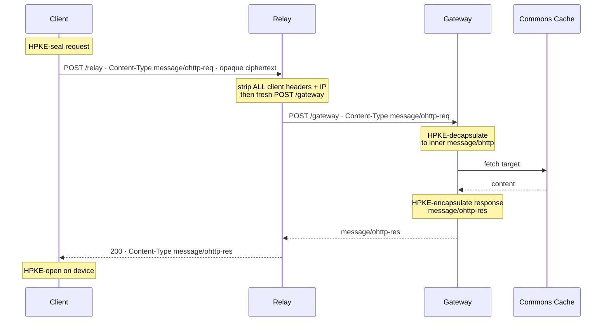

# ohttp-relay

The relay half of the OHTTP ([RFC 9458](https://www.rfc-editor.org/rfc/rfc9458)) split-trust pair. It's the only component that ever sees a client's IP address, and it can do nothing with it, because everything it forwards is an opaque HPKE ciphertext it can't decrypt.

Node 24 HTTP relay with an optional Azure Table redemption adapter. The locked Azure dependency is loaded only when its connection is configured.

## Why it exists

OHTTP deliberately keeps who and what with two different parties:

| Party | Sees the client IP? | Sees the request content? |
|---|---|---|
| Relay (this service) | yes | no, only `message/ohttp-req` ciphertext |
| Gateway | no, the relay sends a fresh request | yes, it holds the HPKE key |

Neither party ever holds identity and content together. That's the operator-blind guarantee. The relay's job is to be the network endpoint the client connects to, and to forward the sealed bytes to the gateway without leaking who the client is.

> Non-collusion caveat: for the guarantee to hold, the relay and gateway have to be run by different, non-colluding parties. Running both on one host proves the flow works but provides no protection against the single operator. See [`../SELFHOSTING.md`](../SELFHOSTING.md).

## The OHTTP request/response flow

*The relay forwards opaque ciphertext to the gateway without leaking who the client is.*


```mermaid
sequenceDiagram
    participant client as Client
    participant relay as Relay
    participant gateway as Gateway
    participant commons as Commons Cache

    Note over client: HPKE-seal request
    client->>relay: POST /relay · Content-Type message/ohttp-req · opaque ciphertext
    Note over relay: strip ALL client headers + IP<br/>then fresh POST /gateway
    relay->>gateway: POST /gateway · Content-Type message/ohttp-req
    Note over gateway: HPKE-decapsulate<br/>to inner message/bhttp
    gateway->>commons: fetch target
    commons-->>gateway: content
    Note over gateway: HPKE-encapsulate response<br/>message/ohttp-res
    gateway-->>relay: message/ohttp-res
    relay-->>client: 200 · Content-Type message/ohttp-res
    Note over client: HPKE-open on device
```

### Content types

| Type | Where | What it is |
|---|---|---|
| `message/ohttp-req` | client -> relay -> gateway | the outer HPKE-encapsulated request envelope (RFC 9458). Opaque to the relay. |
| `message/ohttp-res` | gateway -> relay -> client | the outer HPKE-encapsulated response envelope. Opaque to the relay. |
| `message/bhttp` | inside the envelope, only after the gateway decrypts | the inner Binary HTTP ([RFC 9292](https://www.rfc-editor.org/rfc/rfc9292)) request/response, the actual GET to the target. The relay never sees this; only the gateway decrypts down to it. |

## Endpoints

| Route | Method | Purpose |
|---|---|---|
| `/health` | `GET` | liveness, returns `ok` |
| `/relay` | `POST` | accepts a `message/ohttp-req` body, forwards it to the gateway's `/gateway`, returns the `message/ohttp-res` body verbatim |
| `/ohttp-configs` | `GET` | proxies the gateway's public key config so clients can pin the key while the gateway stays internal |

## What it deliberately does not forward

When it relays to the gateway, the service builds a fresh request and sends only:

- the opaque ciphertext body, and
- `Content-Type: message/ohttp-req` plus `Content-Length`.

It leaves out every client header and never adds `X-Forwarded-For`, so the gateway can't learn the client's IP. (See `server.js`. That omission is the security property, not an oversight.)

That fresh request goes out over a keep-alive pool rather than a new TLS handshake per request. The relay never automatically replays the ciphertext: a connection reset can follow a committed inner write, even when no response reached the client.

## Observability

RED metrics only, structured JSON to stdout:

```json
{"ts":"…","route":"/relay","status":200,"durationMs":212}
```

No IP, no content, no headers, no target. `route` is a fixed template.

Both `/relay` and `/ohttp-configs` cancel outbound work when the caller disconnects and log one terminal outcome. A failure adds a bounded `reason` and normalized transport `code`, so a 502 is attributable:

| `reason` | Meaning |
|---|---|
| `gw_error` | the request to the gateway errored; also logs `reused` (whether the socket came from the keep-alive pool) |
| `gres_error` | the gateway errored part-way through its response |
| `resp_too_large` | the gateway response exceeded `MAX_RESP_BYTES` |
| `client_disconnect` | the caller disconnected; outbound gateway work was cancelled (logged status 499) |
| `rate_limit` / `capacity` | per-client budget exhausted / process concurrency cap reached |
| `origin` / `client_auth` | front-door origin lock / client authorization rejected |

An uncaught exception or unhandled rejection logs a bounded `{event, code, errorType}` and exits non-zero. Free-form messages, stack text, unknown request paths and unknown error codes are excluded by the logging boundary.

The relay never automatically replays ciphertext after a connection reset, even on a reused socket. The gateway may already have committed an inner write before its response was lost. The client, which knows the inner method, decides whether a retry is safe.

## Configuration

| Env var | Default | Purpose |
|---|---|---|
| `PORT` | `8080` | listen port (non-root can't bind below 1024) |
| `GATEWAY_URL` | required | full gateway endpoint, e.g. `https://<gateway-host>/gateway` |
| `CLIENT_AUTH_MODE` | `off` | `off`, `secret`, or `token` (Privacy Pass / Private Access Token) |
| `CLIENT_SECRET` | (none) | required in `secret` mode; the credential clients present in `CLIENT_AUTH_HEADER`. Unset in `secret` mode fails closed (every request rejected) |
| `CLIENT_AUTH_HEADER` | `x-columbia-token` | header clients present their credential in, for both `secret` and `token` mode |
| `ISSUER_KEYS_URL` | unset | in `token` mode, the issuer's `GET /issuer-keys`, e.g. `https://<issuer-host>/issuer-keys` |
| `ISSUER_KEYS_TTL_MS` | `300000` | how often the relay refreshes the cached issuer public keys |
| `TOKEN_PSS_SALT_LEN` | `48` | RSA-PSS salt length for token verification (SHA-384 digest length) |
| `REDEMPTION_MAX_KEYS` | `5000000` | single-process memory capacity; full capacity fails503, never evicts a live spend |
| `REDEMPTION_CONNECTION_STRING` | unset | Relay-operator Azure Table credential; enables shared durable redemption; never issuer-state credentials |
| `REDEMPTION_TABLE` | `columbiaredemptions` | Dedicated relay spend table |
| `RATE_LIMIT_RPM` | `120` | per-IP requests per minute; `0` disables per-IP limiting |
| `RATE_WINDOW_MS` | `60000` | the window `RATE_LIMIT_RPM` is measured over |
| `RATE_MAX_KEYS` | `100000` | per-IP rate-limit bucket memory bound |
| `MAX_INFLIGHT` | `256` | global cap on concurrent relays; further requests get a 429 |
| `MAX_BODY_BYTES` | `65536` | request body size cap |
| `MAX_RESP_BYTES` | `5000000` | gateway response size cap |
| `GW_TIMEOUT_MS` | `15000` | timeout for a relay→gateway request |
| `CONFIG_TTL_MS` | `120000` | how long the `GET /ohttp-configs` passthrough response is cached |
| `TRUSTED_CLIENT_IP_HEADER` | _(empty)_ | header a trusted front proxy sets to the real client IP (e.g. `x-azure-socketip`, `cf-connecting-ip`). Set it whenever a request crosses more than one proxy (front proxy + platform ingress), or every client collapses into one rate-limit bucket. Empty keeps single-proxy rightmost-`X-Forwarded-For` behaviour |
| `RELAY_GATEWAY_SECRET` | (none) | shared secret sent to the gateway as `X-Columbia-Relay-Auth`; set the SAME value on the gateway so it rejects traffic that did not come through the relay |
| `GATEWAY_CONFIGS_URL` | gateway host + `/ohttp-configs` | where the relay fetches the gateway key config it passes through at `GET /ohttp-configs` |
| `REQUIRE_FDID` | (none) | front-door origin lock: when set, reject any request that did not arrive through the edge front door (which injects `X-Azure-FDID`). `GET /health` is exempt. Unset disables the check |
| `FDID_HEADER` | `x-azure-fdid` | name of the header the edge front door injects for the `REQUIRE_FDID` lock above; override for a non-Azure CDN or WAF that injects a differently named header |
| `LOG_HEALTH` | unset | successful `GET /health` probe hits are not logged (at platform probe cadence they are almost all log volume, drowning the RED signal); set `1` to log them again for a debugging session. Failing probes are unaffected |

### Token mode (Privacy Pass)

In `token` mode the relay accepts an anonymous, unlinkable blind-RSA token in the
auth header and verifies it offline against the issuer's epoch public key
(RSA-PSS/SHA-384, the RFC 9578 / Apple PAT suite), then enforces spend-once. There
is no per-request call to the issuer: the relay fetches the public key once from
`ISSUER_KEYS_URL` and caches it, so the issuer never learns which token was spent.
That offline, public verification is what keeps the token unlinkable. The issuer
half lives in [`../token-issuer`](../token-issuer). The optional Azure adapter makes create-only
spend decisions across replicas and restarts. Each row stores only a random claim
ID, full public-key fingerprint partition and signature hash. A409 is already
spent; a lost ACK is accepted only if readback proves this exact claim; other
unconfirmed storage results return503/Retry-After 2. SDK retries are disabled and
all storage waits share a 5-second deadline. The memory fallback fails closed at
capacity and never evicts spends, but is still single-process.

Key metadata is fetched with a 5-second total deadline,64KiB response bound,
single-flight and 5-second retry/negative backoff. Public-key IDs are checked
against actual material. Cached keys never survive their declared epoch horizon
even when refresh fails. Unknown keys in a valid cache reject401; no valid keys
or unavailable spend state return503. The global in-flight cap includes pending
authentication even after the client disconnects.

Spend rows have no automatic TTL or cap eviction. Storage cost therefore grows
with accepted tokens. Cleanup requires a separately reviewed permanent retirement
fence for actual key material; deleting rows solely because an epoch number aged
would allow reused keys to revive spent tokens. The current implementation favors
retention over unsafe implicit expiration. Production token enforcement remains a
separate staged rollout with older-client and physical-device acceptance.

## Local validation

Run `npm ci && npm test` (Node 24). The local HTTPS gateway exercises successful forwarding,
ambiguous resets without replay, response size limits, response-stream resets,
timeouts, aborted uploads, caller disconnects, slot recovery, and config caching.
Every gateway failure and cancellation must produce exactly one outcome log.

## Run locally

```sh
GATEWAY_URL='https://<gateway-host>/gateway' PORT=8080 node server.js
curl localhost:8080/health         # -> ok
# POST a real message/ohttp-req body produced by an OHTTP client to test the path
```

Or with Docker:

```sh
docker build -t columbia-relay .
docker run --rm -p 8080:8080 \
  -e PORT=8080 -e GATEWAY_URL='https://<gateway-host>/gateway' \
  columbia-relay
```

Runs as the non-root `node` user on port 8080. For the real operator-blind guarantee, deploy this on a different operator than the gateway. See [`../SELFHOSTING.md`](../SELFHOSTING.md).

### Process termination

SIGTERM/SIGINT stop new admission and drain existing HTTP plus owned asynchronous
work for at most 25 seconds. Client socket closure does not make pending
authentication or an issuer reservation disappear. Clean drain exits 0; the hard
deadline exits 1 and does not imply rollback of a write whose ACK was lost. Allow
a platform termination grace greater than this bound.
